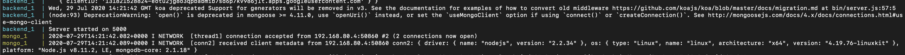
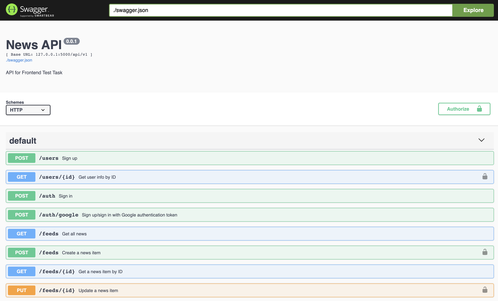
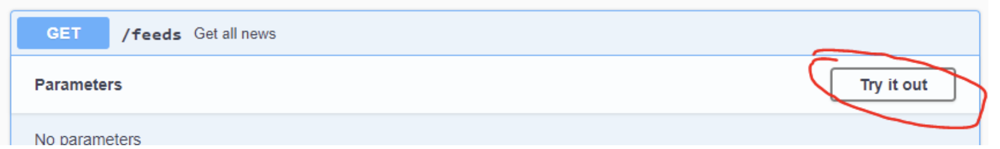
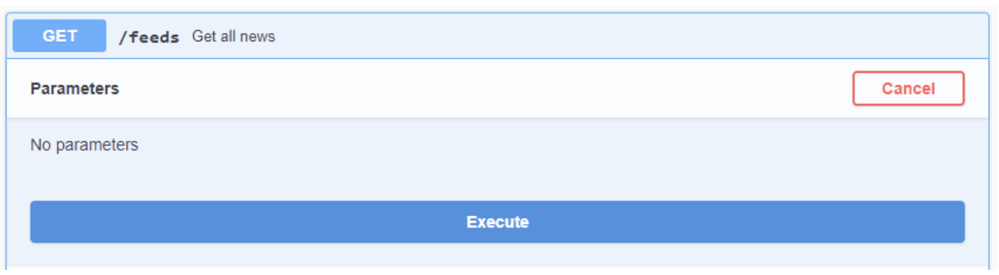

Бэкенд для Тестового Задания
===

+ Бэкенд предназначен для решения [тестового задания](https://htmlpreview.github.io/?https://bitbucket.org/i-d-c/frontendtesttask/raw/5b1a88b50e5f01622e53b4253a5fe5ff4d921b1f/index.html).
+ Для решения ТЗ вам потребуется запустить бэкенд локально и ознакомиться с его API, которое задокументировано с помощью Swagger'a. Подробности ниже.

## Предварительная настройка
1. Для начала склонируйте этот репозиторий:
  ```
  git clone git@bitbucket.org:i-d-c/frontendtesttask.git
  ```
2. В настройках проекта вам нужно указать свой client ID для авторизации через Google. Созданный ClientID нужно будет указать в файле `backend/config/env/common.js`. Этот же ClientID вам нужно будет использовать на фронтенде.

_backend/config/env/common.js_

```
...
google: {
  clientID: "ВАШ_ID_ЗДЕСЬ" // остальные поля конфига не трогайте
}
...
```

## Запуск через Docker
Прежде всего, нужно установить и запустить Docker локально на своей машине. После этого запуск бэкенда будет предельно простым, поэтому мы настоятельно рекомендуем воспользоваться данным способом.

1. [Скачайте и установите Docker](https://store.docker.com/).
2. После запуска (подождите, пока иконка докера будет статичной), чтобы убедиться, что Docker установлен и запущен, в командой строке введите:
   ```
   docker info
   ```
   Примерный вывод команды:
   ```
   Containers: 41
   Running: 1
   Paused: 0
   Stopped: 40
   Images: 24
   Server Version: 18.06.1-ce
   Storage Driver: overlay2
   Backing Filesystem: extfs
   Supports d_type: true
   Native Overlay Diff: true
   Logging Driver: json-file
   Cgroup Driver: cgroupfs
   ...
   ```
   Это значит, что Docker установлен и работает в штатном режиме.
3. Перейдите в директорию проекта и запустите бэкенд:
   ```
   cd frontendtesttask (или название вашей директории, куда вы скачали репозиторий)
   docker-compose up --build
   ```
   Выполнение команды может занять некоторое время - Docker выкачает необходимые образы и установит все зависимости для проекта. Когда приложение запустится, вы увидите в консоли следующее:

   
4. Чтобы проверить, что бэкенд работает, откройте Swagger UI и сделайте несколько запросов к API бэкенда. Для этого:
    1. В браузере перейдите на `localhost` (без указания порта). Должен открыться Swagger UI, из котрого можно делать запросы на бэкенд:
    
    2. В качестве пробного запроса можно выполнить запрос `GET` на получение списка новостей. Нужно нажать на "Try it out":
    
    А затем на "Execute":
    
    В качестве ответа вы увидите список новостей. Пока что он будет пустой.
    Подробности по использованию Swagger даны [ниже](#использование-swagger-ui).

## Запуск без Docker
Если вы по какой-то причине не хотите использовать Docker, вы можете запустить все компоненты приложения поотдельности.

1. [Скачайте Mongo DB Server](https://www.mongodb.com/download-center/community). После установки нужно запустить базу. Как это сделать описано [в документации](https://docs.mongodb.com/manual/installation/#tutorial-installation).

   > Важно, чтобы база данных была запущена в первую очередь.

2. Запустите бэкенд:
    ```
    npm install
    npm run start
    ```

3. Запустите Swagger UI. Как это сделать описано [в документации](https://github.com/swagger-api/swagger-ui/blob/master/docs/usage/installation.md).

## Использование Swagger UI
Для полноценного взаимодействия с бэкендом через Swagger UI вам потребуется авторизоваться.

1. Для начала вам нжуно авторизоваться через Google. Как это сделать подробно описано [в уроке авторизация с помощью Google Sign In](https://maxpfrontend.ru/vebinary/avtorizatsiya-s-pomoschyu-google-sign-in/). В результате вы должны получить token от Google, который нужно будет передать бэкенду для авторизации.

2. Авторизуйтесь на бэкенде. Для этого нужно отправить запрос `POST` на адрес `/auth/google` с полученным токеном в качестве параметра. В ответ вы получите токен авторизации на бэкенде, который можно использовать для создания и изменения новостей и просмотра профиля.

3. Вверху страницы нажмите на кнопку "Authorize" и вставьте полученный токен. Теперь вы можете выполнять запросы, требующие авторизации.

4. Для проверки авторизации попробуйте создать новость. Для этого отправьте запрос `POST` на адрес `/feeds` с необходимыми параметрами. Если все прошло хорошо, значит вы авторизованы.

> Токен авторизации действителен в течение часа, после этого его нужно обновлять. Для этого повторите шаги 2-3. Авторизоваться заново в Google не нужно.
